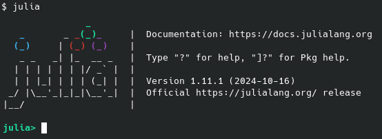

# Getting started with Julia

## Julia installieren

Es gibt verschiedene Wege, die nötigen Programme für die Programmiersprache Julia zu installieren. In der Regel erfolgt dies über den Paketmanager des jeweiligen Betriebssystems. In manchen Fällen ist jedoch eine manuelle Installation notwendig.

Im Folgenden findest du Anleitungen für die gängigsten Betriebssysteme.

````{hint}
Befehle in `Typewriter-Schrift` im Text, oder abgesetzt in
```
einer hervorgehobenen Box
```
können in ein Terminal oder eine Kommandozeile eingegeben werden. Wenn du noch keine Erfahrung mit der Kommandozeile hast, empfehlen wir das Video: ["Kommandozeile Lernen in 20 Minuten - Tutorial für Anfänger"](https://www.youtube.com/watch?v=4xjaPQCiBfM) [^video-no-connection]
````

[^video-no-connection]: Es besteht kein Zusammenhang zwischen dem Video, dessen Autor und der Universität bzw. dieser Lehrveranstaltung.

### Windows
Julia kann direkt über den [Microsoft Store](https://www.microsoft.com/store/apps/9NJNWW8PVKMN) installiert werden.
Nutze dafür folgenden Befehl in der Windows-Kommandozeile (`cmd.exe` oder PowerShell):

```shell
winget install julia -s msstore
```

Alternativ kann auch `juliaup` verwendet werden (siehe unten).

### macOS & Linux
Für macOS und viele Linux-Distributionen lässt sich Julia bequem über ein Installationsskript von der offiziellen Webseite installieren. Öffne dazu ein Terminal und gib folgenden Befehl ein:

```shell
curl -fsSL https://install.julialang.org | sh
```
sollen
1. Howmebrew (macOS): `brew install juliaup`
2. OpenSuse (Linux): `zypper install juliaup`
3. cargo (Rust): `cargo install juliaup`

`juliaup` bietet zusätzliche Flexibilität, z. B. parallele Versionen oder automatische Updates - besonders nützlich, wenn du längerfristig mit Julia arbeitest.


## Julia als Taschenrechner

Die einfachste Art Julia zu verwenden und damit zu experimentieren ist die interaktive *REPL* (*Read-Eval-Print-Loop*) Umgebung. Es ist eine spezielle Eingabeaufforderung in der direkt Julia Code ausgeführt werden kann. Sie lässt sich starten mittels Doppelklick auf das Julia Program, oder durch Ausführen des Befehls `julia` in einer Komandozeile.



Wie bei einem Taschenrechner gibt man den zu berechnenden Ausdruck ein, z.B. `123.4 + 234.5` und bekommt nach bestätigung mit der `[Enter]` Taste das Ergebnis angezeigt. Das letzte Antwort lässt sich auch immer wiederholen oder in folgenden Ausdrücken verwenden, mittels der Variable `ans`

```
julia> 123.4 + 234.5
357.9
```

```
julia> ans + 1
358.9
```

## Editor einrichten

Für die Entwicklung von Code benötigt man einen Editor. Dieser erlaubt i.d.R. nicht nur einfache Texteingabe, sondern häufig auch die farbliche Darstellung von Code (Syntax-Highlighting), die Integration von Compilern und Programmiertools, sowie Projektverarbeitung. Wir empfehlen VS Code, mit der offiziellen Julia-Erweiterung für diese Vorlesung (oder die Alternative VS Codium)

**VS Code + Julia Extension:**
1. Lade [Visual Studio Code](https://code.visualstudio.com/) herunter und installiere es.
2. Installiere die [Julia Extension](https://code.visualstudio.com/docs/languages/julia)

VS Code bietet Syntax Highlighting, REPL-Integration, IntelliSense, Plot-Output und mehr - ideal für den Julia-Workflow!


## Jupyter Notebooks mit Julia

Jupyter Notebooks sind ideal, um Julia-Code mit erklärendem Text und Visualisierungen zu kombinieren. Sie werde auch in den Übungen verwendet.

**Einrichtung:**
Starte Julia und installiere das Paket `IJulia`:

```julia
using Pkg
Pkg.add("IJulia")
```

Starte ein Notebook:

```julia
using IJulia
IJulia.notebook()
```

Dies offnet Jupyter in deinem Browser. dort kannst du dann Dateien mit der Endnung `.ipynb`.

Alternative kann man auch `jupyterlab` mittels

```shell
pip install jupyterlab
```

installieren und dann im Terminal

```shell
jupyter lab
```

starten.


## Julia Code ausführen

Neben dem Starten eines Julia Notebooks, lässt sich Code auch auf verschiedene andere Weise ausführen.

**Interaktive Konsole (REPL):**
Dies haben wir schon im Kapitel "Julia als Taschenrechner" gesehen:

Einfach julia im Terminal starten:

```shell
julia
```

du erhälts eine interaktive Umgebung (Read-Eval-Print-Loop - REPL), ideal zum Ausprobieren und starten von Julia code:

```
julia> println("Hallo Welt")
Hallo Welt
```

**Skripte (`.jl`-Dateien):**
Code kann in einer Datei mit der Endung `.jl` abgespeichert werden. Diesen kann man entweder direkt im Terminal ausführen:

```shell
julia mein_script.jl
```

oder innerhalb der REPL Umgebung laden:

```
julia> include("mein_script.jl")
```

Insbesondere hinsichtlich der Ausgabe von Zwischenergebnissen unterscheiden sich beide Methoden etwas. Es wird empfohlen code über die REPL zu laden anstelle ein Script auszuführen.

**Innerhalb von VS Code oder Jupyter:**
Der Editor ist mit einer einer integrierten REPL Umgebung verbunden. Scripte lassen sich einfach per Klick auf den Play-Button starten. Zusätzlich erlaub der Editor das öffnen von Jupyter Notebooks (`.ipynb`-Dateien), in dem einzelne Zellen ausgeführt oder das ganze Notebook abgearbeitet werden kann.

## Nützliche Links

- [Exercism's Julia Track](https://exercism.org/tracks/julia)
- [Julia Documentation](https://docs.julialang.org/en/v1/)
- [Julia Getting Started Tutorial](https://docs.julialang.org/en/v1/manual/getting-started/)
- [Modern Julia Workflow](https://modernjuliaworkflows.org/)
- [The Julia Language's YouTube channel](https://www.youtube.com/user/JuliaLanguage/playlists)